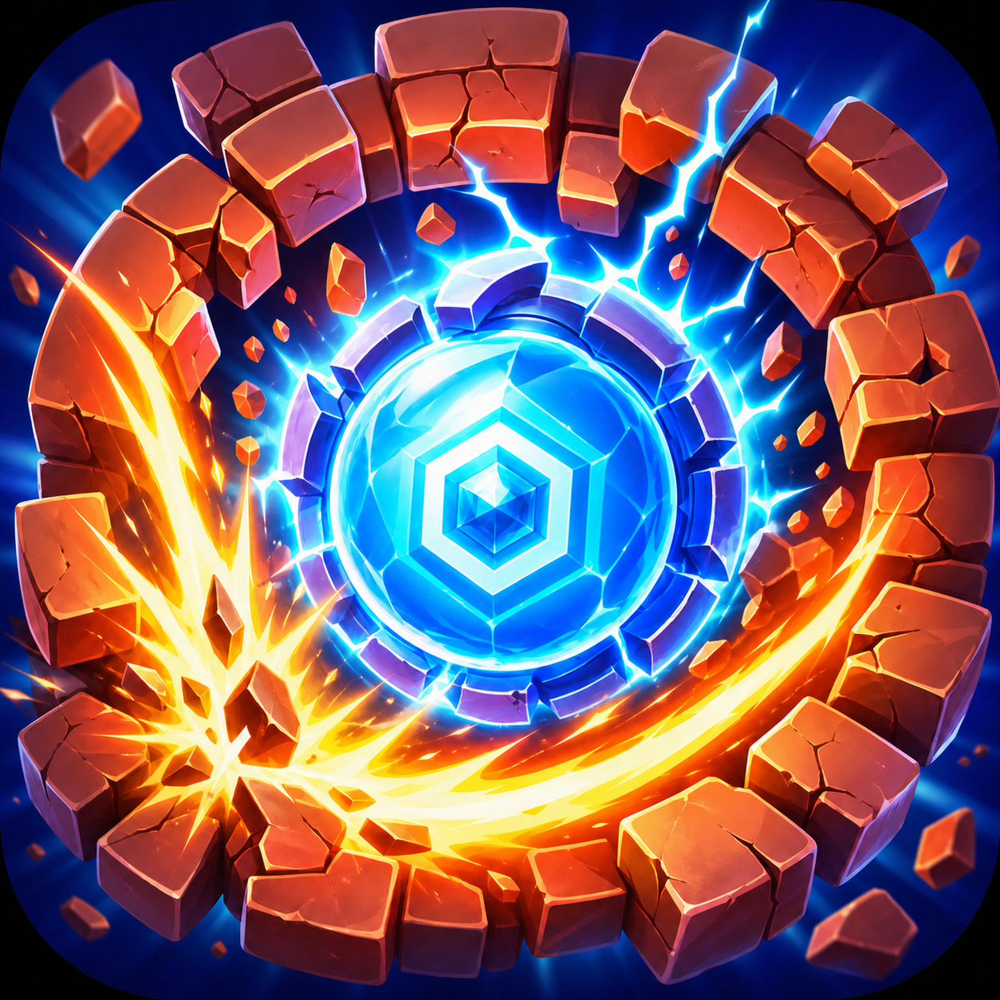
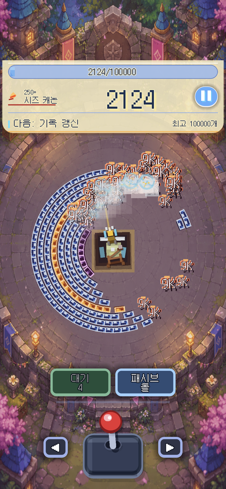
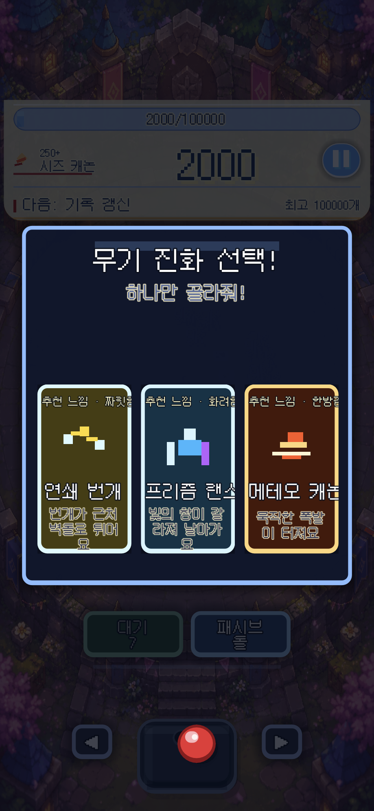

  

  

<h1 align="center">Core Breaker</h1>

  <strong>A portrait mobile radial-defense arcade game built with Godot.</strong>

  Defend the central core, break shrinking circular brick walls, and survive through escalating weapon progression.

  
  
  
  
  

---

## What is Core Breaker?

**Core Breaker** is a mobile-first arcade defense game where the battlefield is built around a single central core.

You aim from the center, fire into shrinking radial brick walls, destroy segments before they reach the core, and survive as the pressure accelerates. The design goal is simple: make a fast, readable, one-hand mobile game with satisfying brick destruction and escalating weapon progression.

---

## Gameplay Preview

  

<!-- Add gameplay-preview.gif under docs/assets/readme/ when available. -->

  
  
  

---

## Core Gameplay

| System | Description |
|---|---|
| **Central Core Defense** | The player protects a fixed core at the center of the arena. |
| **Radial Brick Walls** | Segmented circular walls shrink inward and create constant spatial pressure. |
| **Directional Aiming** | A mobile joystick controls the firing angle from the central core. |
| **Brick Destruction** | Projectiles break wall segments and open survival paths. |
| **Weapon Progression** | Weapons evolve as the player destroys more bricks and survives longer. |
| **Portrait Mobile Design** | Built for 9:16 mobile play with fast readability and one-hand interaction. |

---

## Download Android APK

The current Android build is distributed as a **private/debug testing APK** through GitHub Releases.

  <a href="https://github.com/Everyseok/core-breaker-godot/releases/download/android-debug-latest/core-breaker-debug.apk">
    <strong>Download core-breaker-debug.apk</strong>
  </a>

Additional links:

- [Latest debug release](https://github.com/Everyseok/core-breaker-godot/releases/tag/android-debug-latest)
- [Android Debug APK workflow](https://github.com/Everyseok/core-breaker-godot/actions/workflows/android-debug-apk.yml)
- [Android phone install guide](docs/ANDROID_PHONE_TEST_FROM_GITHUB.md)

> This is a debug/private testing build, not a final production store release.

---

## Install on Android

1. Download `core-breaker-debug.apk`.
2. Open the APK on your Android device.
3. If Android blocks installation, allow **Install unknown apps** for your browser or file manager.
4. Launch **Core Breaker Debug** from the app drawer.

For detailed steps, see:

[Android phone test from GitHub](docs/ANDROID_PHONE_TEST_FROM_GITHUB.md)

---

## Tech Stack

| Area | Stack |
|---|---|
| Game Engine | Godot |
| Scripting | GDScript |
| Target Device | Android / Mobile portrait |
| Build Output | Debug APK |
| CI / Build Pipeline | GitHub Actions |
| Release Preparation | Google Play / App-in-Toss |
| Documentation | Markdown-based release and audit docs |

---

## Current Build

Core Breaker is currently available as a **private Android debug build** for hands-on device testing.

The game already presents its core arcade loop: a glowing center core, radial brick pressure, directional attacks, and weapon progression tuned for portrait mobile play. The public-facing repository page is kept focused on what the game is, how it plays, and how testers can try the current APK.

---

## License

Source code is licensed under the [MIT License](LICENSE).

Game assets are not automatically covered by the MIT License. Artwork, branding images, screenshots, marketing images, fonts, audio, exported game resources, and store/App-in-Toss submission materials are covered by their own rights or asset-specific license records. See [NOTICE](NOTICE) for the repository license scope.

---

## Repository Notes

This repository is currently used for private development, Android debug testing, and release preparation.

The direct APK link depends on a successful GitHub Actions build and publication to the `android-debug-latest` release tag. If the release asset is unavailable, use the latest successful workflow artifact from the Android Debug APK workflow.

---

## Author

**Jun Seok Kim** 
Independent Researcher & AI Builder 
GitHub: [@Everyseok](https://github.com/Everyseok) 
Website: [about-jun-seok-kim.vercel.app](https://about-jun-seok-kim.vercel.app/)

---

  <strong>Break the walls. Defend the core.</strong>

