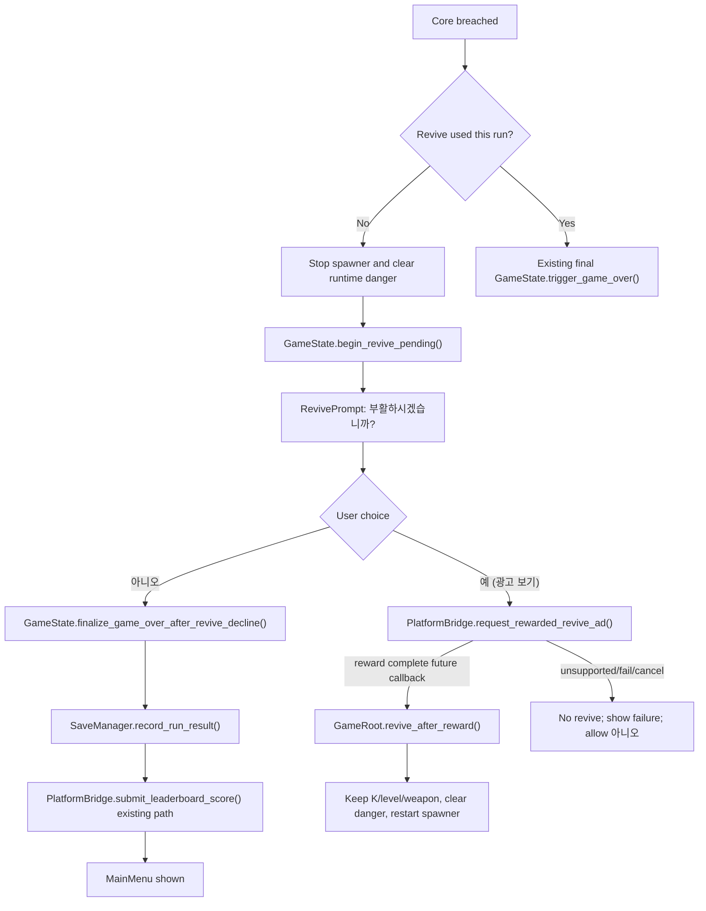

# Rewarded Revive Implementation Report

## Summary

This pass adds a rewarded-revive decision flow without guessing an unverified App-in-Toss runtime binding.

- Result: RevivePrompt UI and gameplay state flow are implemented.
- Runtime Toss ad call: intentionally stubbed and fails gracefully until a verified Godot Web binding for `@apps-in-toss/web-framework` is available.
- Current local/non-Toss behavior: tapping `예 (광고 보기)` shows a clear unavailable message; tapping `아니오` finalizes game over, saves the run, submits leaderboard through the existing path, and returns to MainMenu.
- MVP rule: one rewarded revive attempt per run.

## Official App-in-Toss Docs Checked

| Area | Official URL | Relevant finding |
|---|---|---|
| In-app ads overview | https://developers-apps-in-toss.toss.im/ads/intro.html | Rewarded ads are user-initiated and suitable for benefits/continue-style moments. Ads should not be excessive; app sound should pause during ad playback and resume after. Test ad IDs must be used during development. |
| Ads console setup | https://developers-apps-in-toss.toss.im/ads/console.html | Ads require business information, settlement information, and ad group creation. Rewarded ad groups require reward name and quantity. Ad group IDs can take up to 2 hours to propagate. |
| Ads development guide | https://developers-apps-in-toss.toss.im/ads/develop.html | Rewarded ads must be voluntarily selected by the user. Test rewarded ID is `ait-ad-test-rewarded-id`. Sandbox does not support in-app ads; test via console QR. |
| Integrated full-screen/rewarded API | https://developers-apps-in-toss.toss.im/bedrock/reference/framework/광고/IntegratedAd.html | Current API is `loadFullScreenAd` then `showFullScreenAd`; both expose `isSupported()`. Reward must be granted only on `userEarnedReward`, not on `dismissed`. |
| Ads QA | https://developers-apps-in-toss.toss.im/ads/qa.html | Real-device QA is required for ad behavior. |
| Game checklist | https://developers-apps-in-toss.toss.im/checklist/app-game.html | Game must preserve safe UX, sound/pause handling, and compliant flow. |
| Toss app test | https://developers-apps-in-toss.toss.im/development/test/toss.html | Toss app/QR validation is required for shell behavior. |
| Sandbox test | https://developers-apps-in-toss.toss.im/development/test/sandbox.html | Sandbox validates many features, but ads must be tested through console QR because sandbox ads are not supported. |
| WebView debugging | https://developers-apps-in-toss.toss.im/learn-more/debugging-webview.html | WebView debugging should be used for runtime integration issues. |

## Official API Names And Semantics

| Item | Official value |
|---|---|
| Current full-screen/rewarded load API | `loadFullScreenAd(params)` from `@apps-in-toss/web-framework` |
| Current full-screen/rewarded show API | `showFullScreenAd(params)` from `@apps-in-toss/web-framework` |
| Support check | `loadFullScreenAd.isSupported()` / `showFullScreenAd.isSupported()` |
| Load callback | `onEvent({ type: 'loaded' })` |
| Show callbacks | `requested`, `show`, `impression`, `clicked`, `dismissed`, `failedToShow`, `userEarnedReward` |
| Reward condition | Grant reward only after `userEarnedReward` |
| Cancel/close behavior | `dismissed` alone is not reward completion |
| Error handling | `onError` must be provided for load/show failures |
| Required ad identifier | `adGroupId` from Toss Ads console |
| Minimum Toss app version | In-app ads 2.0 ver2: Toss app `5.247.0+`; `5.227.0 ~ 5.247.0` supports older AdMob-only path; `<5.227.0` unsupported |
| Sandbox support | In-app ads are not supported in sandbox; use console QR testing |

## Runtime Binding Decision

The official docs confirm TypeScript/React WebView SDK API names, but this Godot Web export does not currently include a verified way to import `@apps-in-toss/web-framework` from GDScript/JavaScriptBridge.

Therefore this pass does **not** call a guessed `window.*` ad function. `PlatformBridge.request_rewarded_revive_ad()` is a safe interface stub:

- Non-Web runtime returns `NOT_WEB`.
- Missing ad group config returns `MISSING_AD_GROUP_ID`.
- Web runtime with an ad group still returns `WEB_FRAMEWORK_BINDING_UNVERIFIED` until the official binding path is added and validated in Toss QR.

## Flow

## Files Changed

- `scripts/autoload/game_state.gd`
- `scripts/autoload/platform_bridge.gd`
- `scripts/gameplay/game_root.gd`
- `scripts/ui/main_menu.gd`
- `scripts/ui/revive_prompt.gd`
- `scenes/ui/revive_prompt.tscn`
- `scenes/ui/root_ui.tscn`
- `docs/REWARDED_REVIVE_IMPLEMENTATION_REPORT.md`

## Behavior Implemented

- Core breach no longer immediately finalizes the first death if revive is available.
- Gameplay danger is stopped and runtime layers are cleared before showing the prompt.
- Revive prompt text:
  - `부활하시겠습니까?`
  - `예 (광고 보기)`
  - `아니오`
- `아니오` finalizes game over through the save/leaderboard path and returns to MainMenu.
- `예 (광고 보기)` calls only `PlatformBridge.request_rewarded_revive_ad()`.
- Reward success path exists through `PlatformBridge.rewarded_revive_ad_completed(true, reason)`, but real Toss callbacks are not wired until the official Godot binding is verified.
- On successful future reward callback:
  - current K is preserved
  - current level is preserved
  - total progress is preserved
  - current weapon tier and weapon choice are preserved
  - run result is not saved
  - leaderboard is not submitted
  - runtime danger is cleared
  - spawner resumes
- On unsupported/fail/cancel:
  - revive is not granted
  - failure text is shown
  - `아니오` remains available for final game over
- Second death in the same run bypasses revive and uses existing final game-over behavior.

## Intentionally Not Changed

- No banner ad implementation.
- No interstitial ad implementation.
- No fake ad UI, fake creative, placeholder ad box, or fake production ID.
- No damage, K thresholds, wall shrink, ring retile, projectile balance, weapon patterns, `CombatProcResolver`, or `WeaponFirePattern` changes.
- No HUD refactor.
- No App-in-Toss production ad group ID committed.

## Manual QA Checklist

- Start game.
- Die once.
- Revive prompt appears instead of immediate final result.
- Tap `아니오`: final game over is saved, leaderboard submit path is called, and MainMenu appears.
- Tap `예 (광고 보기)` in local Godot/non-Web: no crash, clear unavailable message appears, no revive is granted.
- Future Toss QR test: reward-complete callback must be the only path that calls `revive_after_reward()`.
- Reward success must preserve K/level/total_progress/weapon tier/active weapon choice.
- Reward success must clear immediate danger and resume spawning/firing.
- Reward cancel/failure/unsupported must not revive.
- Second death in the same run must not offer revive again.
- Existing pause/restart/start menu still work.
- APK workflow files are unchanged.

## Remaining Blocker

Real Toss rewarded-ad invocation is blocked until the project has:

- App-in-Toss console access.
- Business and settlement setup.
- Rewarded ad group creation.
- Test or production `adGroupId`.
- A verified Godot Web bridge/import path for `@apps-in-toss/web-framework`.
- Toss console QR device validation.
